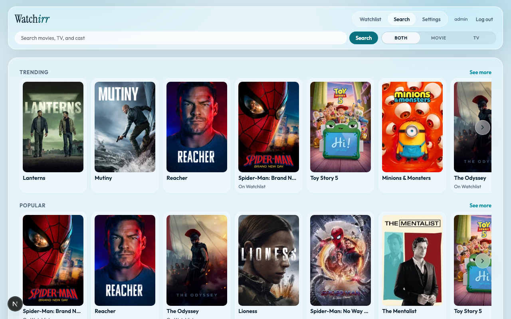
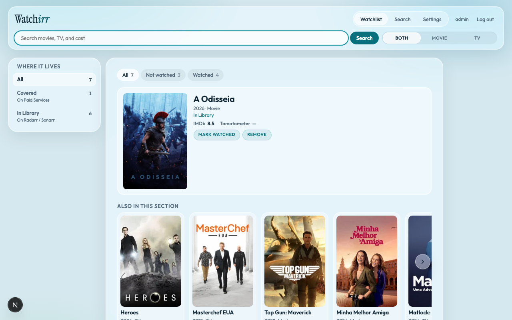

# Watchirr

**One watchlist for your Jellyfin household — search, coverage check, acquire, and watched in a single app.**

Only sends titles to Radarr/Sonarr when they are not already on a streaming service you pay for — so a finite disk budget is not wasted on what you can already watch.

The streaming-aware watchlist for self-hosted Jellyfin households.



## What it does

- **Search** movies and TV (TMDB), with Discover rails when the query is empty
- **Watchlist** shared by the household — still to watch, coming in, watched
- **Streaming coverage** — checks your paid subscription services before acquiring
- **Acquire** into Radarr (movies) or Sonarr (selected seasons) only when coverage is missing
- **Watched** from Jellyfin playback progress, or mark by hand when you streamed it elsewhere



## Run it

You need Docker (Compose v2) **or** Portainer with Stacks.

### 1. Docker Compose

```bash
docker compose -f docker-compose.example.yml up -d
```

Open http://localhost:3001

### 2. Portainer

**Stacks → Add stack** → paste [`portainer-stack.yml`](./portainer-stack.yml) → deploy.

Open `http://<host>:3001`

Both paths use the published image `ghcr.io/watchirr/watchirr:v1.0.1` and store SQLite at `./data/watchirr.db` on the host. Optional Postgres and reverse-proxy notes live in **[docs/self-host.md](./docs/self-host.md)**.

## First run

1. Open the URL above. With an empty database you land on **/setup**.
2. Create the Admin login and password (at least 8 characters).
3. Sign in. Later visits use **/login**.

That Admin is the only user in the MVP.

## Settings checklist

After login, open **Settings** and save after each probe. URLs must be reachable **from the Watchirr container**.

| Step | What to set |
|------|-------------|
| 1 | **TMDB** API key → load countries/services → pick **country** and **paid services** |
| 2 | **Radarr** URL + API key → load → default root folder and quality profile |
| 3 | **Sonarr** URL + API key → load → defaults (TV acquires selected seasons only) |
| 4 | **Jellyfin** URL + API key (watched sync) |
| 5 | **OMDb** API key — optional, for IMDb / Tomatometer public ratings |

Integration keys live in Settings, not in the compose file. Full field-by-field detail: **[docs/self-host.md](./docs/self-host.md)**.

## Using the app

1. **Search** for a title (or browse Discover with an empty query).
2. **Add to Watchlist** — Watchirr re-checks streaming coverage.
3. If it is on a paid service you configured → it stays on the list for streaming.
4. If not → **Acquire** into Radarr or Sonarr (unless it is already in the library).
5. Mark **Watched** by hand, or let Jellyfin playback progress do it.
6. **Remove** clears the watchlist item; if it was acquired locally, Radarr/Sonarr can drop files too.

## Integrations

| Service | Role | Get a key / docs |
|---------|------|------------------|
| [TMDB](https://www.themoviedb.org/settings/api) | Title search and watch-provider coverage | Required |
| [Radarr](https://radarr.video/) | Acquire movies | Required for movie acquire |
| [Sonarr](https://sonarr.tv/) | Acquire TV (selected seasons) | Required for TV acquire |
| [Jellyfin](https://jellyfin.org/) | Watched from playback progress | Recommended |
| [OMDb](https://www.omdbapi.com/apikey.aspx) | Public ratings (IMDb, Tomatometer) | Optional |

## FAQ

**Do I need Radarr and Sonarr?**  
For acquiring local copies, yes — movies go to Radarr, TV to Sonarr. You can still keep a watchlist of streaming-covered titles without acquiring.

**What counts as “already on streaming”?**  
Subscription (flatrate) on at least one paid service you configured for your country. Rent and buy do not count.

**Does it work with Plex?**  
Not yet. Playback / watched sync is **Jellyfin-only** for now.

**Where is my data?**  
Default: `./data/watchirr.db` on the Docker host. Backup guidance and Postgres: [docs/self-host.md](./docs/self-host.md).

**Can I develop from source?**  
Yes: `npm install && npm run dev` (or `npm run docker:dev`). Open http://localhost:3001. Smoke: `npm run check`.

## Docs

| Doc | Job |
|-----|-----|
| This README | Zero → using the app |
| [docs/self-host.md](./docs/self-host.md) | Durability, Postgres, Traefik, full Settings, Locale, edge cases |

## License

[MIT](./LICENSE) © 2026 Nilson Bertola
